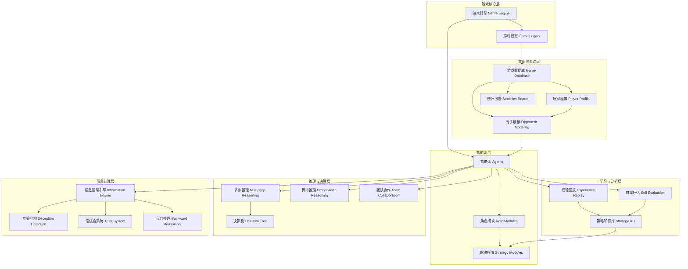
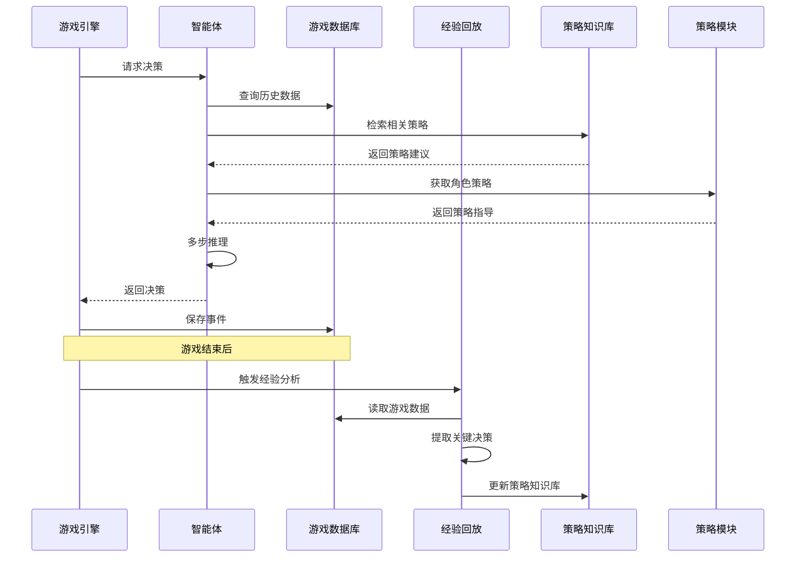

# 设计文档

## 概述

本设计文档描述了狼人杀游戏AI智能体增强系统的架构和实现方案。该系统在现有的AgentScope多智能体框架基础上，构建一套完整的学习、推理和策略优化机制，使AI玩家能够从历史对局中学习、动态调整策略、进行深度推理，并在信息不完全的环境中做出更智能的决策。

系统的核心目标是：
1. 实现跨局学习能力，让智能体能够从经验中持续进化
2. 为不同角色提供专门的策略模块，提升角色扮演的真实性
3. 建立完整的数据追踪和分析体系，支持性能评估和优化
4. 增强决策质量，通过多步推理和概率计算提升智能体水平
5. 提升信息推理能力，让智能体能够在不完全信息下做出合理判断

## 架构

### 系统架构图




### 分层说明

1. **游戏核心层**：现有的游戏引擎和日志系统，负责游戏流程控制和基础数据记录
2. **智能体层**：AI玩家及其角色和策略模块，负责游戏中的决策和行动
3. **学习与分析层**：经验回放、策略知识库和自我评估，负责跨局学习和策略优化
4. **数据与追踪层**：游戏数据库、玩家画像、对手建模和统计报告，负责数据持久化和分析
5. **推理与决策层**：多步推理、概率推理、决策树和团队协作，负责提升决策质量
6. **信息处理层**：信息推理引擎、欺骗检测、信任度系统和反向推理，负责处理不完全信息

## 组件和接口

### 1. 游戏数据库 (Game Database)

**职责**：持久化存储所有游戏数据，支持跨局查询和分析

**数据模型**：
```python
# 游戏记录
class GameRecord:
    game_id: str
    start_time: datetime
    end_time: datetime
    winner: str  # "werewolf" or "villager"
    total_rounds: int
    players: List[PlayerInGame]

# 游戏中的玩家
class PlayerInGame:
    player_id: str
    player_name: str
    role: str
    survived: bool
    survival_rounds: int

# 回合记录
class RoundRecord:
    game_id: str
    round_num: int
    phase: str  # "night" or "day"
    events: List[GameEvent]

# 游戏事件
class GameEvent:
    event_id: str
    game_id: str
    round_num: int
    timestamp: datetime
    event_type: str  # "speech", "vote", "skill", "death"
    player_id: str
    content: dict  # 事件具体内容

# 发言记录
class SpeechRecord(GameEvent):
    content: {
        "text": str,
        "category": str,  # "werewolf_discussion", "day_discussion"
    }

# 投票记录
class VoteRecord(GameEvent):
    content: {
        "target": str,
        "vote_type": str,  # "werewolf_vote", "day_vote"
    }

# 技能使用记录
class SkillRecord(GameEvent):
    content: {
        "skill_type": str,  # "kill", "heal", "poison", "check", "shoot"
        "target": str,
    }
```

**接口**：
```python
class GameDatabase:
    def save_game(self, game_record: GameRecord) -> None
    def save_event(self, event: GameEvent) -> None
    def get_game(self, game_id: str) -> GameRecord
    def get_player_games(self, player_id: str) -> List[GameRecord]
    def get_events_by_game(self, game_id: str) -> List[GameEvent]
    def query_events(self, filters: dict) -> List[GameEvent]
```


### 2. 经验回放系统 (Experience Replay)

**职责**：分析历史对局，提取关键决策点和经验教训

**数据模型**：
```python
class Experience:
    experience_id: str
    game_id: str
    round_num: int
    context: dict  # 决策时的上下文信息
    decision: dict  # 做出的决策
    outcome: dict  # 决策的结果
    quality_score: float  # 决策质量评分 (0-1)
    lesson: str  # 经验教训描述

class KeyDecisionPoint:
    game_id: str
    round_num: int
    player_id: str
    decision_type: str  # "vote", "skill_use", "speech_strategy"
    situation: dict  # 当时的局势
    options: List[dict]  # 可选方案
    chosen_option: dict  # 选择的方案
    impact: str  # "positive", "negative", "neutral"
```

**接口**：
```python
class ExperienceReplay:
    def analyze_game(self, game_id: str) -> List[Experience]
    def extract_key_decisions(self, game_id: str) -> List[KeyDecisionPoint]
    def evaluate_decision_quality(self, decision: KeyDecisionPoint) -> float
    def generate_lesson(self, decision: KeyDecisionPoint) -> str
```

### 3. 策略知识库 (Strategy Knowledge Base)

**职责**：存储和检索策略模式，支持策略学习和复用

**数据模型**：
```python
class StrategyPattern:
    pattern_id: str
    pattern_name: str
    role: str  # 适用角色
    situation: dict  # 适用情境
    action: dict  # 推荐行动
    success_count: int
    failure_count: int
    confidence: float  # 置信度 (0-1)
    examples: List[str]  # 示例game_id列表

class StrategyQuery:
    role: str
    current_situation: dict
    top_k: int  # 返回前k个最相关策略
```

**接口**：
```python
class StrategyKnowledgeBase:
    def add_pattern(self, pattern: StrategyPattern) -> None
    def query_strategies(self, query: StrategyQuery) -> List[StrategyPattern]
    def update_pattern_stats(self, pattern_id: str, success: bool) -> None
    def get_pattern_by_id(self, pattern_id: str) -> StrategyPattern
```

### 4. 角色策略模块 (Role Strategy Modules)

**职责**：为每个角色提供专门的策略指导和决策支持

**接口**：
```python
class BaseRoleStrategy:
    def get_strategy_prompt(self, situation: dict) -> str
    def evaluate_risk(self, situation: dict) -> float
    def suggest_action(self, situation: dict, options: List) -> dict

class WerewolfStrategy(BaseRoleStrategy):
    def select_kill_target(self, alive_players: List, threat_scores: dict) -> str
    def generate_disguise_speech(self, target_role: str, context: dict) -> str
    def coordinate_with_team(self, team_info: dict) -> dict

class SeerStrategy(BaseRoleStrategy):
    def select_check_target(self, alive_players: List, suspicion_scores: dict) -> str
    def decide_reveal_timing(self, situation: dict) -> bool
    def generate_check_report(self, check_result: dict) -> str

class WitchStrategy(BaseRoleStrategy):
    def decide_heal(self, killed_player: str, situation: dict) -> bool
    def decide_poison(self, alive_players: List, suspicion_scores: dict) -> Optional[str]

class HunterStrategy(BaseRoleStrategy):
    def decide_shoot(self, alive_players: List, situation: dict) -> Optional[str]

class VillagerStrategy(BaseRoleStrategy):
    def analyze_speeches(self, speeches: List[dict]) -> dict
    def decide_vote(self, alive_players: List, analysis: dict) -> str
```


### 5. 玩家画像系统 (Player Profile)

**职责**：追踪和分析每个智能体的行为模式和表现

**数据模型**：
```python
class PlayerProfile:
    player_id: str
    total_games: int
    total_wins: int
    overall_win_rate: float
    role_stats: Dict[str, RoleStats]  # 按角色统计
    behavior_patterns: List[BehaviorPattern]
    style_tags: List[str]  # 如 "aggressive", "cautious", "deceptive"

class RoleStats:
    role: str
    games_played: int
    wins: int
    win_rate: float
    avg_survival_rounds: float
    key_decision_success_rate: float

class BehaviorPattern:
    pattern_type: str
    description: str
    frequency: float
    effectiveness: float
```

**接口**：
```python
class PlayerProfileSystem:
    def get_profile(self, player_id: str) -> PlayerProfile
    def update_profile(self, player_id: str, game_result: GameRecord) -> None
    def identify_behavior_patterns(self, player_id: str) -> List[BehaviorPattern]
    def calculate_win_rate(self, player_id: str, role: Optional[str] = None) -> float
```

### 6. 对手建模系统 (Opponent Modeling)

**职责**：学习和预测其他玩家的行为倾向

**数据模型**：
```python
class OpponentModel:
    player_id: str
    observed_behaviors: List[dict]
    predicted_role: Optional[str]
    role_probability: Dict[str, float]  # 各角色的概率
    strategy_tendency: dict  # 策略倾向
    confidence: float

class BehaviorObservation:
    round_num: int
    action_type: str
    action_details: dict
    context: dict
```

**接口**：
```python
class OpponentModeling:
    def create_model(self, player_id: str) -> OpponentModel
    def update_model(self, player_id: str, observation: BehaviorObservation) -> None
    def predict_action(self, player_id: str, situation: dict) -> dict
    def get_role_probability(self, player_id: str) -> Dict[str, float]
```

### 7. 多步推理引擎 (Multi-step Reasoning)

**职责**：在关键决策点进行深度推理和方案评估

**数据模型**：
```python
class ReasoningTask:
    task_id: str
    decision_type: str
    current_situation: dict
    available_options: List[dict]
    reasoning_depth: int  # 推理深度

class ReasoningStep:
    step_num: int
    hypothesis: str
    evidence: List[dict]
    conclusion: str
    confidence: float

class ActionPlan:
    option: dict
    expected_outcome: dict
    risk_score: float
    reward_score: float
    overall_score: float
    reasoning_chain: List[ReasoningStep]
```

**接口**：
```python
class MultiStepReasoning:
    def analyze_decision(self, task: ReasoningTask) -> List[ActionPlan]
    def simulate_outcome(self, option: dict, situation: dict) -> dict
    def evaluate_plan(self, plan: ActionPlan) -> float
    def select_best_option(self, plans: List[ActionPlan]) -> dict
```


### 8. 概率推理系统 (Probabilistic Reasoning)

**职责**：基于贝叶斯推理计算玩家身份概率

**数据模型**：
```python
class ProbabilityState:
    player_probabilities: Dict[str, Dict[str, float]]  # player_id -> role -> probability
    evidence_history: List[Evidence]
    last_update: datetime

class Evidence:
    evidence_type: str  # "speech", "vote", "death_pattern", "skill_result"
    source: str
    content: dict
    reliability: float
    impact: Dict[str, float]  # 对各玩家概率的影响
```

**接口**：
```python
class ProbabilisticReasoning:
    def initialize_probabilities(self, players: List[str], roles: List[str]) -> ProbabilityState
    def update_probabilities(self, state: ProbabilityState, evidence: Evidence) -> ProbabilityState
    def get_werewolf_probability(self, player_id: str, state: ProbabilityState) -> float
    def get_most_likely_role(self, player_id: str, state: ProbabilityState) -> str
```

### 9. 决策树系统 (Decision Tree)

**职责**：模拟不同选择的后续发展和结果

**数据模型**：
```python
class DecisionNode:
    node_id: str
    decision: dict
    situation: dict
    children: List['DecisionNode']
    expected_value: float
    visit_count: int

class SimulationPath:
    path: List[DecisionNode]
    final_outcome: dict
    probability: float
    value: float
```

**接口**：
```python
class DecisionTree:
    def build_tree(self, root_situation: dict, depth: int) -> DecisionNode
    def simulate_path(self, node: DecisionNode, max_depth: int) -> SimulationPath
    def calculate_expected_value(self, node: DecisionNode) -> float
    def get_best_decision(self, root: DecisionNode) -> dict
```

### 10. 信息推理引擎 (Information Reasoning Engine)

**职责**：从不完全信息中推断隐藏信息

**数据模型**：
```python
class InformationState:
    known_facts: List[dict]
    inferred_facts: List[dict]
    uncertainties: List[dict]
    contradictions: List[dict]

class Inference:
    inference_type: str  # "role_deduction", "alliance_detection", "strategy_prediction"
    premises: List[dict]
    conclusion: dict
    confidence: float
    reasoning: str
```

**接口**：
```python
class InformationReasoningEngine:
    def extract_information(self, speech: str) -> List[dict]
    def infer_role(self, player_id: str, observations: List[dict]) -> Inference
    def detect_alliance(self, vote_pattern: dict) -> List[Inference]
    def analyze_death_pattern(self, deaths: List[dict]) -> List[Inference]
```

### 11. 欺骗检测系统 (Deception Detection)

**职责**：识别虚假发言和逻辑矛盾

**数据模型**：
```python
class DeceptionIndicator:
    player_id: str
    speech_id: str
    indicator_type: str  # "logical_contradiction", "fact_conflict", "pattern_anomaly"
    description: str
    severity: float  # 0-1

class SpeechAnalysis:
    speech_id: str
    player_id: str
    content: str
    logical_consistency: float
    fact_alignment: float
    deception_score: float
    indicators: List[DeceptionIndicator]
```

**接口**：
```python
class DeceptionDetection:
    def analyze_speech(self, speech: dict, context: dict) -> SpeechAnalysis
    def check_logical_consistency(self, speech: str, history: List[str]) -> float
    def detect_contradictions(self, player_id: str, speeches: List[dict]) -> List[DeceptionIndicator]
    def calculate_deception_score(self, analysis: SpeechAnalysis) -> float
```


### 12. 信任度系统 (Trust System)

**职责**：动态评估每个玩家的可信度

**数据模型**：
```python
class TrustScore:
    player_id: str
    overall_trust: float  # 0-1
    trust_history: List[TrustUpdate]
    factors: Dict[str, float]  # 影响因素及权重

class TrustUpdate:
    timestamp: datetime
    event: dict
    impact: float  # 正负影响
    reason: str
    new_score: float
```

**接口**：
```python
class TrustSystem:
    def initialize_trust(self, players: List[str]) -> Dict[str, TrustScore]
    def update_trust(self, player_id: str, event: dict, impact: float) -> TrustScore
    def get_trust_score(self, player_id: str) -> float
    def get_most_trusted(self, players: List[str], top_k: int) -> List[str]
```

### 13. 反向推理系统 (Backward Reasoning)

**职责**：从结果反推原因和身份

**数据模型**：
```python
class BackwardInference:
    observation: dict  # 观察到的结果
    possible_causes: List[dict]  # 可能的原因
    likelihood: Dict[str, float]  # 每个原因的可能性
    implications: List[dict]  # 推论

class CausalChain:
    effect: dict
    cause: dict
    intermediate_steps: List[dict]
    probability: float
```

**接口**：
```python
class BackwardReasoning:
    def infer_from_death(self, death_info: dict, context: dict) -> BackwardInference
    def infer_from_skill_use(self, skill_event: dict, context: dict) -> BackwardInference
    def infer_from_vote(self, vote_result: dict, context: dict) -> BackwardInference
    def build_causal_chain(self, effect: dict, context: dict) -> List[CausalChain]
```

### 14. 自我评估系统 (Self Evaluation)

**职责**：评估智能体自身的决策质量并生成改进建议

**数据模型**：
```python
class DecisionRecord:
    decision_id: str
    round_num: int
    decision_type: str
    context: dict
    chosen_action: dict
    expected_result: dict
    actual_result: dict
    quality_score: float

class ImprovementSuggestion:
    decision_id: str
    issue: str
    suggestion: str
    priority: str  # "high", "medium", "low"
    applicable_situations: List[dict]
```

**接口**：
```python
class SelfEvaluation:
    def record_decision(self, decision: DecisionRecord) -> None
    def evaluate_decision(self, decision_id: str, actual_result: dict) -> float
    def generate_suggestions(self, decision_id: str) -> List[ImprovementSuggestion]
    def get_learning_history(self, player_id: str) -> List[ImprovementSuggestion]
```

### 15. 团队协作系统 (Team Collaboration)

**职责**：支持狼人团队的信息共享和策略协调

**数据模型**：
```python
class TeamInformation:
    team_members: List[str]
    shared_knowledge: dict
    threat_assessment: Dict[str, float]  # player_id -> threat_score
    target_priority: List[str]
    coordination_plan: dict

class TeamDecision:
    decision_type: str
    proposal: dict
    supporters: List[str]
    consensus_level: float
```

**接口**：
```python
class TeamCollaboration:
    def share_information(self, team: List[str], info: dict) -> TeamInformation
    def assess_threats(self, team_info: TeamInformation, alive_players: List[str]) -> Dict[str, float]
    def coordinate_strategy(self, team_info: TeamInformation) -> dict
    def reach_consensus(self, team: List[str], proposals: List[dict]) -> TeamDecision
```


### 16. 统计报告系统 (Statistics Report)

**职责**：生成各类统计报告和可视化数据

**数据模型**：
```python
class WinRateReport:
    player_id: str
    overall_win_rate: float
    role_win_rates: Dict[str, float]
    time_series: List[Tuple[datetime, float]]  # 时间趋势

class RolePerformanceReport:
    role: str
    avg_survival_rounds: float
    key_decision_success_rate: float
    common_mistakes: List[str]
    best_practices: List[str]

class DecisionAnalysisReport:
    decision_type: str
    choice_distribution: Dict[str, int]
    success_rates: Dict[str, float]
    optimal_choices: List[dict]
```

**接口**：
```python
class StatisticsReport:
    def generate_win_rate_report(self, player_id: str) -> WinRateReport
    def generate_role_performance_report(self, role: str) -> RolePerformanceReport
    def generate_decision_analysis_report(self, decision_type: str) -> DecisionAnalysisReport
    def export_report(self, report: Any, format: str) -> str  # "json", "html", "pdf"
```

## 数据模型

### 核心数据流



### 数据库Schema

使用SQLite作为轻量级数据库解决方案：

```sql
-- 游戏记录表
CREATE TABLE games (
    game_id TEXT PRIMARY KEY,
    start_time TIMESTAMP,
    end_time TIMESTAMP,
    winner TEXT,
    total_rounds INTEGER
);

-- 玩家游戏记录表
CREATE TABLE player_games (
    id INTEGER PRIMARY KEY AUTOINCREMENT,
    game_id TEXT,
    player_id TEXT,
    player_name TEXT,
    role TEXT,
    survived BOOLEAN,
    survival_rounds INTEGER,
    FOREIGN KEY (game_id) REFERENCES games(game_id)
);

-- 事件记录表
CREATE TABLE events (
    event_id TEXT PRIMARY KEY,
    game_id TEXT,
    round_num INTEGER,
    phase TEXT,
    timestamp TIMESTAMP,
    event_type TEXT,
    player_id TEXT,
    content TEXT,  -- JSON格式
    FOREIGN KEY (game_id) REFERENCES games(game_id)
);

-- 经验记录表
CREATE TABLE experiences (
    experience_id TEXT PRIMARY KEY,
    game_id TEXT,
    round_num INTEGER,
    player_id TEXT,
    context TEXT,  -- JSON格式
    decision TEXT,  -- JSON格式
    outcome TEXT,  -- JSON格式
    quality_score REAL,
    lesson TEXT,
    FOREIGN KEY (game_id) REFERENCES games(game_id)
);

-- 策略模式表
CREATE TABLE strategy_patterns (
    pattern_id TEXT PRIMARY KEY,
    pattern_name TEXT,
    role TEXT,
    situation TEXT,  -- JSON格式
    action TEXT,  -- JSON格式
    success_count INTEGER,
    failure_count INTEGER,
    confidence REAL
);

-- 玩家画像表
CREATE TABLE player_profiles (
    player_id TEXT PRIMARY KEY,
    total_games INTEGER,
    total_wins INTEGER,
    overall_win_rate REAL,
    role_stats TEXT,  -- JSON格式
    behavior_patterns TEXT,  -- JSON格式
    style_tags TEXT  -- JSON格式
);
```


## 正确性属性

*属性是一个特征或行为，应该在系统的所有有效执行中保持为真——本质上是关于系统应该做什么的形式化陈述。属性作为人类可读规范和机器可验证正确性保证之间的桥梁。*

### 属性 1: 经验数据往返一致性
*对于任何*生成的经验数据，如果将其存储到策略知识库，然后从知识库中检索，应该得到等价的数据结构
**验证: 需求 1.3**

### 属性 2: 策略模式排序正确性
*对于任何*策略查询结果，返回的策略列表应该按照成功率降序排列
**验证: 需求 2.4**

### 属性 3: 决策记录完整性
*对于任何*关键决策，决策记录应该包含上下文信息和预期结果两个必需字段
**验证: 需求 3.1**

### 属性 4: 角色策略模块加载一致性
*对于任何*角色对象，其策略模块的类型应该与角色类型匹配（狼人→WerewolfStrategy，预言家→SeerStrategy等）
**验证: 需求 4.1, 4.2, 4.3, 4.4, 4.5, 4.6**

### 属性 5: 风险等级与策略模式对应性
*对于任何*局势评估，当风险等级高于阈值时，策略模式应该是保守的；当风险等级低于阈值且优势明显时，策略模式应该是激进的
**验证: 需求 5.2, 5.3**

### 属性 6: 游戏事件数据库持久化
*对于任何*游戏事件（发言、投票、技能使用），事件发生后应该能在数据库中找到对应的记录
**验证: 需求 7.2, 7.3, 7.4**

### 属性 7: 胜率计算正确性
*对于任何*智能体，其胜率应该等于胜场数除以总场数
**验证: 需求 8.2**

### 属性 8: 对手模型置信度单调性
*对于任何*对手模型，当预测准确时置信度应该增加，当预测失败时置信度应该减少或参数应该改变
**验证: 需求 9.3, 9.4**

### 属性 9: 统计报告内容完整性
*对于任何*胜率报告，应该包含总体胜率、角色胜率和时间趋势三个字段
**验证: 需求 10.2**

### 属性 10: 多步推理候选方案多样性
*对于任何*多步推理任务，生成的候选方案数量应该大于1
**验证: 需求 11.2**

### 属性 11: 最优方案选择正确性
*对于任何*评估完成的方案集合，最终选择的方案应该是综合评分最高的方案
**验证: 需求 11.5, 13.5**

### 属性 12: 狼人概率初始化均匀性
*对于任何*游戏开始时的概率状态，所有玩家的狼人概率应该相等（先验概率）
**验证: 需求 12.1**

### 属性 13: 身份确认后概率确定性
*对于任何*被确认身份的玩家，如果是狼人则概率应该为1，如果不是狼人则概率应该为0
**验证: 需求 12.4**

### 属性 14: 决策树分支完整性
*对于任何*选择集合，构建的决策树应该为每个选择创建对应的分支
**验证: 需求 13.1**

### 属性 15: 团队信息共享完整性
*对于任何*狼人夜晚讨论，每个狼人智能体掌握的信息应该被共享到团队信息池中
**验证: 需求 14.1**

### 属性 16: 信息提取非空性
*对于任何*非空发言，信息提取应该返回至少一个关键信息点
**验证: 需求 15.1**

### 属性 17: 逻辑矛盾检测敏感性
*对于任何*包含逻辑矛盾的发言，一致性分析应该标记该发言为可疑
**验证: 需求 16.2**

### 属性 18: 信任度初始化中性
*对于任何*游戏开始时的信任度状态，所有玩家的信任度分数应该等于中性值（如0.5）
**验证: 需求 17.1**

### 属性 19: 信任度更新方向性
*对于任何*信任度更新事件，真实发言应该增加信任度，虚假发言应该降低信任度
**验证: 需求 17.2, 17.3**

### 属性 20: 反向推理状态更新
*对于任何*完成的反向推理，相关玩家的身份判断应该被更新
**验证: 需求 18.5**


## 错误处理

### 1. 数据库错误处理

**场景**: 数据库连接失败或查询错误
**处理策略**:
- 实现重试机制（最多3次）
- 使用连接池管理数据库连接
- 记录详细错误日志
- 降级策略：如果数据库不可用，使用内存缓存继续游戏

**实现**:
```python
class DatabaseErrorHandler:
    def execute_with_retry(self, operation, max_retries=3):
        for attempt in range(max_retries):
            try:
                return operation()
            except DatabaseError as e:
                if attempt == max_retries - 1:
                    logger.error(f"Database operation failed after {max_retries} attempts: {e}")
                    raise
                time.sleep(2 ** attempt)  # 指数退避
```

### 2. LLM调用错误处理

**场景**: LLM API调用失败、超时或返回无效响应
**处理策略**:
- 实现超时机制（默认30秒）
- 对于结构化输出，验证schema
- 提供默认fallback响应
- 记录失败的prompt和响应

**实现**:
```python
class LLMErrorHandler:
    def call_with_fallback(self, agent, prompt, structured_model=None, timeout=30):
        try:
            response = agent(prompt, structured_model=structured_model, timeout=timeout)
            if structured_model:
                self.validate_schema(response, structured_model)
            return response
        except TimeoutError:
            logger.warning(f"LLM call timeout for {agent.name}")
            return self.get_default_response(prompt, structured_model)
        except ValidationError as e:
            logger.error(f"Invalid LLM response: {e}")
            return self.get_default_response(prompt, structured_model)
```

### 3. 数据验证错误

**场景**: 输入数据格式不正确或缺少必需字段
**处理策略**:
- 使用Pydantic进行数据验证
- 提供清晰的错误消息
- 对于可选字段提供默认值
- 拒绝无效数据并记录

**实现**:
```python
from pydantic import BaseModel, ValidationError

class DataValidator:
    def validate_and_parse(self, data: dict, model: type[BaseModel]):
        try:
            return model(**data)
        except ValidationError as e:
            logger.error(f"Data validation failed: {e}")
            raise ValueError(f"Invalid data format: {e.errors()}")
```

### 4. 推理错误处理

**场景**: 推理过程中出现逻辑错误或无法得出结论
**处理策略**:
- 设置推理深度限制，防止无限递归
- 对于无法推理的情况，返回不确定状态
- 记录推理失败的上下文
- 提供降级推理策略（简化版）

**实现**:
```python
class ReasoningErrorHandler:
    def safe_reasoning(self, reasoning_task, max_depth=5):
        try:
            if reasoning_task.depth > max_depth:
                logger.warning(f"Reasoning depth exceeded: {reasoning_task.depth}")
                return self.simplified_reasoning(reasoning_task)
            return self.full_reasoning(reasoning_task)
        except Exception as e:
            logger.error(f"Reasoning failed: {e}")
            return UncertainResult(reason=str(e))
```

### 5. 并发错误处理

**场景**: 多个智能体同时访问共享资源
**处理策略**:
- 使用锁机制保护共享资源
- 实现事务性操作
- 检测和解决死锁
- 使用异步操作减少阻塞

**实现**:
```python
import asyncio
from threading import Lock

class ConcurrencyHandler:
    def __init__(self):
        self.locks = {}
    
    async def safe_access(self, resource_id, operation):
        if resource_id not in self.locks:
            self.locks[resource_id] = asyncio.Lock()
        
        async with self.locks[resource_id]:
            return await operation()
```

## 测试策略

### 单元测试

单元测试用于验证各个组件的独立功能：

**测试范围**:
1. **数据模型测试**: 验证Pydantic模型的验证逻辑
2. **数据库操作测试**: 测试CRUD操作的正确性
3. **策略模块测试**: 测试各角色策略的决策逻辑
4. **推理引擎测试**: 测试推理算法的正确性
5. **工具函数测试**: 测试辅助函数的边界情况

**测试框架**: pytest

**示例**:
```python
def test_experience_storage_and_retrieval():
    """测试经验数据的存储和检索"""
    db = GameDatabase(":memory:")
    experience = Experience(
        experience_id="exp_001",
        game_id="game_001",
        round_num=1,
        context={"situation": "test"},
        decision={"action": "vote"},
        outcome={"result": "success"},
        quality_score=0.8,
        lesson="Test lesson"
    )
    
    db.save_experience(experience)
    retrieved = db.get_experience("exp_001")
    
    assert retrieved.experience_id == experience.experience_id
    assert retrieved.quality_score == experience.quality_score
```

### 属性基础测试

属性基础测试用于验证系统的通用属性在各种输入下都成立：

**测试框架**: Hypothesis (Python的属性测试库)

**配置**: 每个属性测试至少运行100次迭代

**测试标注**: 每个属性测试必须包含注释，明确引用设计文档中的属性编号

**示例**:
```python
from hypothesis import given, strategies as st

@given(
    wins=st.integers(min_value=0, max_value=100),
    total=st.integers(min_value=1, max_value=100)
)
def test_win_rate_calculation(wins, total):
    """
    **Feature: ai-agent-enhancement, Property 7: 胜率计算正确性**
    
    对于任何智能体，其胜率应该等于胜场数除以总场数
    """
    # 确保wins不超过total
    wins = min(wins, total)
    
    profile = PlayerProfile(
        player_id="test_player",
        total_games=total,
        total_wins=wins,
        overall_win_rate=0.0,  # 将被计算
        role_stats={},
        behavior_patterns=[],
        style_tags=[]
    )
    
    system = PlayerProfileSystem()
    calculated_rate = system.calculate_win_rate(profile.player_id)
    expected_rate = wins / total
    
    assert abs(calculated_rate - expected_rate) < 0.001
```


**更多属性测试示例**:

```python
@given(
    players=st.lists(st.text(min_size=1), min_size=3, max_size=9, unique=True),
    roles=st.lists(st.sampled_from(["werewolf", "villager", "seer", "witch", "hunter"]), min_size=3, max_size=9)
)
def test_initial_werewolf_probability_uniformity(players, roles):
    """
    **Feature: ai-agent-enhancement, Property 12: 狼人概率初始化均匀性**
    
    对于任何游戏开始时的概率状态，所有玩家的狼人概率应该相等
    """
    # 确保玩家和角色数量一致
    players = players[:len(roles)]
    
    reasoning = ProbabilisticReasoning()
    state = reasoning.initialize_probabilities(players, roles)
    
    probabilities = [state.player_probabilities[p]["werewolf"] for p in players]
    
    # 所有概率应该相等
    assert len(set(probabilities)) == 1
    # 概率应该等于先验概率
    expected_prob = roles.count("werewolf") / len(roles)
    assert abs(probabilities[0] - expected_prob) < 0.001


@given(
    strategies=st.lists(
        st.fixed_dictionaries({
            "pattern_id": st.text(min_size=1),
            "success_count": st.integers(min_value=0, max_value=100),
            "failure_count": st.integers(min_value=0, max_value=100)
        }),
        min_size=2,
        max_size=10
    )
)
def test_strategy_sorting_correctness(strategies):
    """
    **Feature: ai-agent-enhancement, Property 2: 策略模式排序正确性**
    
    对于任何策略查询结果，返回的策略列表应该按照成功率降序排列
    """
    # 计算成功率
    for s in strategies:
        total = s["success_count"] + s["failure_count"]
        s["success_rate"] = s["success_count"] / total if total > 0 else 0
    
    kb = StrategyKnowledgeBase()
    for s in strategies:
        pattern = StrategyPattern(
            pattern_id=s["pattern_id"],
            pattern_name="test",
            role="werewolf",
            situation={},
            action={},
            success_count=s["success_count"],
            failure_count=s["failure_count"],
            confidence=s["success_rate"],
            examples=[]
        )
        kb.add_pattern(pattern)
    
    query = StrategyQuery(role="werewolf", current_situation={}, top_k=len(strategies))
    results = kb.query_strategies(query)
    
    # 验证排序
    for i in range(len(results) - 1):
        assert results[i].confidence >= results[i + 1].confidence


@given(
    player_id=st.text(min_size=1),
    is_werewolf=st.booleans()
)
def test_identity_confirmation_probability_determinism(player_id, is_werewolf):
    """
    **Feature: ai-agent-enhancement, Property 13: 身份确认后概率确定性**
    
    对于任何被确认身份的玩家，如果是狼人则概率应该为1，如果不是狼人则概率应该为0
    """
    reasoning = ProbabilisticReasoning()
    state = reasoning.initialize_probabilities([player_id], ["werewolf" if is_werewolf else "villager"])
    
    # 模拟身份确认
    evidence = Evidence(
        evidence_type="identity_confirmed",
        source="system",
        content={"player_id": player_id, "role": "werewolf" if is_werewolf else "villager"},
        reliability=1.0,
        impact={player_id: 1.0 if is_werewolf else -1.0}
    )
    
    updated_state = reasoning.update_probabilities(state, evidence)
    probability = updated_state.player_probabilities[player_id]["werewolf"]
    
    if is_werewolf:
        assert abs(probability - 1.0) < 0.001
    else:
        assert abs(probability - 0.0) < 0.001


@given(
    trust_events=st.lists(
        st.tuples(
            st.text(min_size=1),  # player_id
            st.booleans()  # is_truthful
        ),
        min_size=1,
        max_size=20
    )
)
def test_trust_score_update_directionality(trust_events):
    """
    **Feature: ai-agent-enhancement, Property 19: 信任度更新方向性**
    
    对于任何信任度更新事件，真实发言应该增加信任度，虚假发言应该降低信任度
    """
    trust_system = TrustSystem()
    player_ids = list(set(player_id for player_id, _ in trust_events))
    trust_scores = trust_system.initialize_trust(player_ids)
    
    for player_id, is_truthful in trust_events:
        initial_score = trust_scores[player_id].overall_trust
        
        event = {
            "type": "speech_verification",
            "player_id": player_id,
            "is_truthful": is_truthful
        }
        
        impact = 0.1 if is_truthful else -0.1
        updated_score = trust_system.update_trust(player_id, event, impact)
        
        if is_truthful:
            assert updated_score.overall_trust >= initial_score
        else:
            assert updated_score.overall_trust <= initial_score
```

### 集成测试

集成测试验证多个组件协同工作的正确性：

**测试场景**:
1. **完整游戏流程测试**: 从游戏开始到结束的完整流程
2. **学习循环测试**: 游戏结束后的经验提取和知识库更新
3. **跨局学习测试**: 验证新游戏能够使用历史经验
4. **多智能体协作测试**: 验证狼人团队协作功能
5. **推理链测试**: 验证多步推理和决策树的完整流程

**示例**:
```python
@pytest.mark.asyncio
async def test_complete_learning_cycle():
    """测试完整的学习循环：游戏 -> 经验提取 -> 知识库更新 -> 新游戏使用"""
    # 1. 运行一局游戏
    game_engine = GameEngine()
    agents = create_test_agents(9)
    game_result = await game_engine.run_game(agents)
    
    # 2. 提取经验
    experience_replay = ExperienceReplay()
    experiences = experience_replay.analyze_game(game_result.game_id)
    
    assert len(experiences) > 0
    
    # 3. 更新知识库
    kb = StrategyKnowledgeBase()
    for exp in experiences:
        pattern = experience_replay.extract_pattern(exp)
        kb.add_pattern(pattern)
    
    # 4. 开始新游戏，验证知识库被使用
    new_agents = create_test_agents(9)
    for agent in new_agents:
        # 验证智能体能够检索到历史策略
        query = StrategyQuery(
            role=agent.role,
            current_situation={"round": 1},
            top_k=5
        )
        strategies = kb.query_strategies(query)
        assert len(strategies) > 0
```

### 性能测试

**测试目标**:
1. 数据库查询性能：单次查询应在100ms内完成
2. 推理性能：多步推理应在5秒内完成
3. 游戏流程性能：单局游戏应在10分钟内完成
4. 内存使用：系统内存占用应小于2GB

**工具**: pytest-benchmark

### 测试覆盖率目标

- 代码覆盖率：>80%
- 属性测试覆盖率：所有正确性属性都有对应的属性测试
- 集成测试覆盖率：所有主要功能流程都有集成测试

## 实现注意事项

### 1. 渐进式实现

由于系统复杂度较高，建议采用渐进式实现策略：

**阶段1: 基础设施**（优先级：高）
- 游戏数据库
- 基础数据模型
- 日志增强

**阶段2: 学习系统**（优先级：高）
- 经验回放
- 策略知识库
- 自我评估

**阶段3: 策略增强**（优先级：中）
- 角色策略模块
- 动态策略调整
- 角色伪装

**阶段4: 分析系统**（优先级：中）
- 玩家画像
- 对手建模
- 统计报告

**阶段5: 推理增强**（优先级：低）
- 多步推理
- 概率推理
- 决策树

**阶段6: 信息处理**（优先级：低）
- 信息推理引擎
- 欺骗检测
- 信任度系统
- 反向推理

### 2. 数据隐私和安全

- 游戏数据应该只包含游戏内信息，不包含个人隐私
- 数据库访问应该有权限控制
- 敏感配置（如API密钥）应该通过环境变量管理

### 3. 可扩展性考虑

- 使用接口和抽象类，便于扩展新的策略模块
- 数据库schema设计应该支持版本迁移
- 推理引擎应该支持插件式扩展

### 4. 性能优化

- 使用缓存减少重复计算
- 数据库查询使用索引优化
- 异步操作减少阻塞
- 批量操作减少数据库访问次数

### 5. 可观测性

- 详细的日志记录
- 关键指标监控（决策时间、推理深度、数据库查询次数等）
- 错误追踪和报警
- 性能分析工具集成

### 6. 与现有系统集成

- 保持与现有GameEngine的兼容性
- 最小化对现有代码的修改
- 使用装饰器模式增强现有功能
- 提供开关控制新功能的启用/禁用

## 技术选型

### 核心技术栈

- **编程语言**: Python 3.8+
- **AI框架**: AgentScope
- **LLM**: 支持DashScope/OpenAI/Ollama
- **数据库**: SQLite（开发/测试），PostgreSQL（生产可选）
- **数据验证**: Pydantic
- **异步框架**: asyncio
- **测试框架**: pytest, Hypothesis
- **日志**: Python logging

### 依赖库

```txt
# 现有依赖
agentscope>=0.0.1
pydantic>=2.0.0
python-dotenv>=1.0.0

# 新增依赖
hypothesis>=6.0.0  # 属性测试
pytest-asyncio>=0.21.0  # 异步测试
pytest-benchmark>=4.0.0  # 性能测试
sqlalchemy>=2.0.0  # ORM（可选）
numpy>=1.24.0  # 数值计算
scipy>=1.10.0  # 科学计算（用于概率推理）
```

## 部署考虑

### 开发环境

- 使用SQLite内存数据库进行快速测试
- 启用详细日志
- 使用较小的推理深度和迭代次数

### 生产环境

- 使用持久化数据库（SQLite文件或PostgreSQL）
- 配置合适的日志级别
- 根据硬件资源调整推理参数
- 启用性能监控

### 配置管理

所有可配置参数应该通过环境变量或配置文件管理：

```bash
# 学习系统配置
ENABLE_LEARNING=true
EXPERIENCE_REPLAY_ENABLED=true
STRATEGY_KB_PATH=./data/strategy_kb.db

# 推理系统配置
MAX_REASONING_DEPTH=5
DECISION_TREE_MAX_DEPTH=3
PROBABILISTIC_REASONING_ENABLED=true

# 性能配置
DATABASE_POOL_SIZE=10
CACHE_SIZE=1000
ASYNC_WORKERS=4
```
